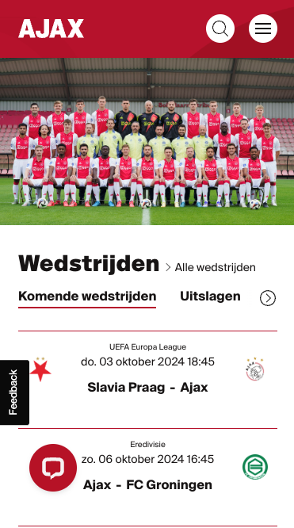
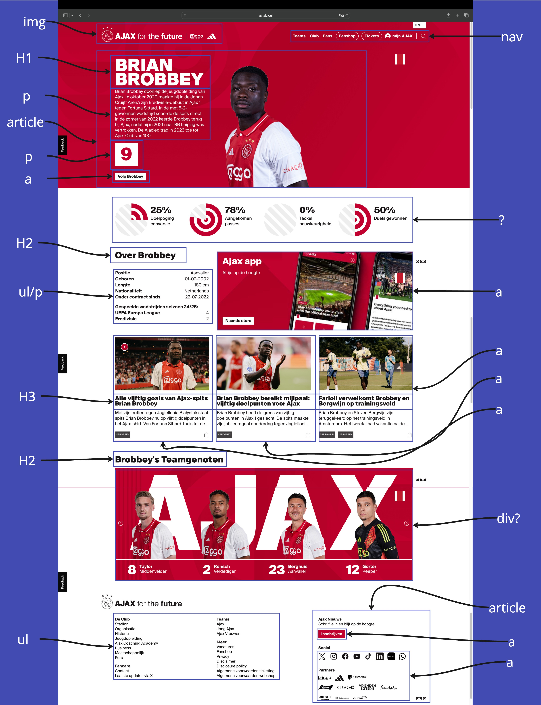
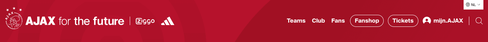
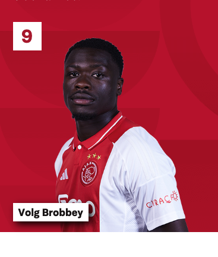
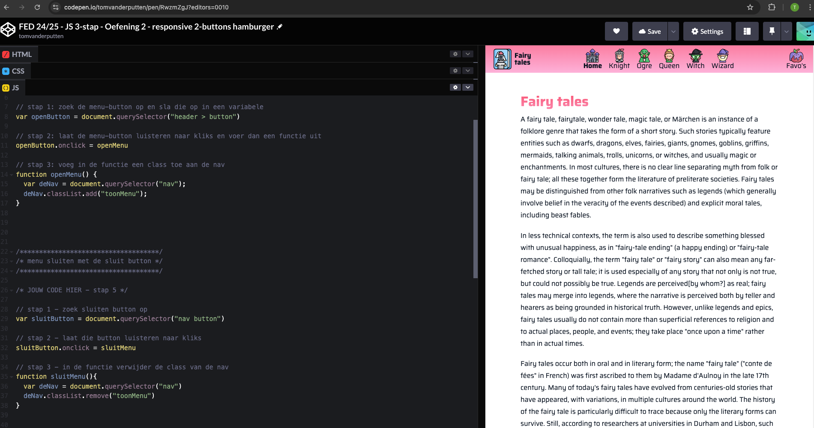
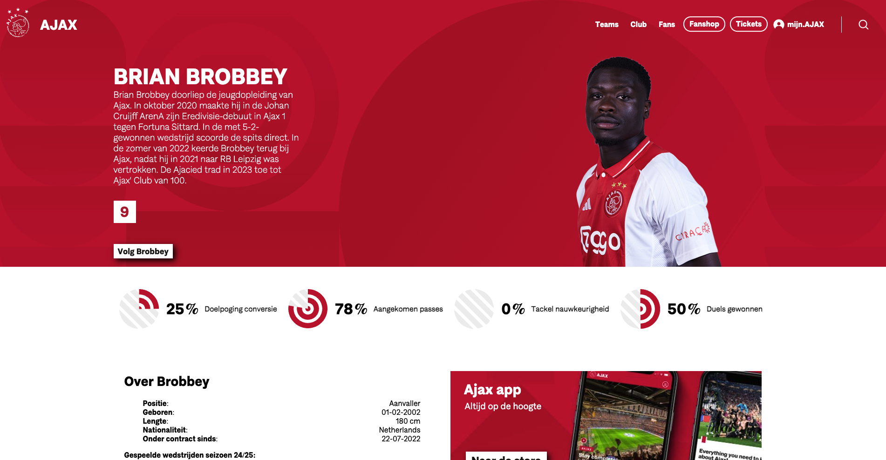
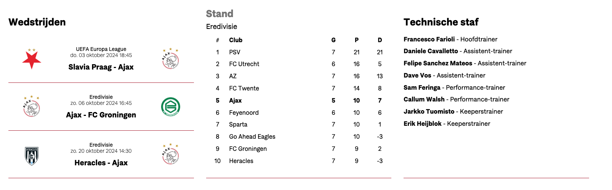
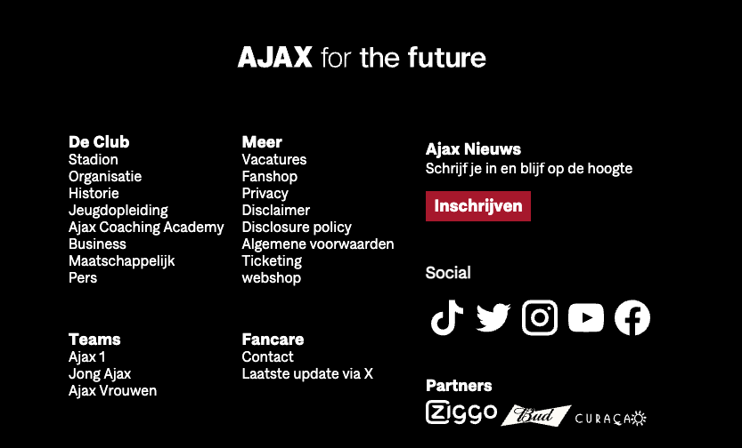
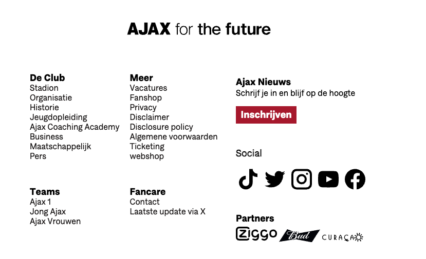

# Procesverslag
Markdown is een simpele manier om HTML te schrijven.  
Markdown cheat cheet: [Hulp bij het schrijven van Markdown](https://github.com/adam-p/markdown-here/wiki/Markdown-Cheatsheet).

Nb. De standaardstructuur en de spartaanse opmaak van de README.md zijn helemaal prima. Het gaat om de inhoud van je procesverslag. Besteedt de tijd voor pracht en praal aan je website.

Nb. Door *open* toe te voegen aan een *details* element kun je deze standaard open zetten. Fijn om dat steeds voor de relevante stuk(ken) te doen.

## Jij

  
uitwerken voor kick-off werkgroep

  ### Auteur:
  Tom van der Putten

  #### Je startniveau:
  Blauw/Rood

  #### Je focus:
  Responsiveness
 

## Je website

  
uitwerken voor kick-off werkgroep

  ### Je opdracht:
  https://www.ajax.nl/teams/ajax-1/

  #### Screenshot(s) van de eerste pagina (small screen): 
  Home page
  https://www.ajax.nl/teams/ajax-1/  
  

  #### Screenshot(s) van de tweede pagina (small screen):
  Spelerinformatie pagina 
  https://www.ajax.nl/teams/ajax-1/brian-brobbey/  
  
 

## Toegankelijkheidstest 1/2 (week 1)

  
uitwerken na test in 2e werkgroep

  ### Bevindingen
  Toen ik voor het eerst de screenreader aan deed begon het al intimiderend omdat er gelijk harde en snelle stemmen aan gingen. Dit was even wennen vooral omdat de screenreader zo snel praatte. Daarnaast duurde het wel een tijdje voordat ik alle controls onder de knieen had en snapte, je moet namelijk meestal drie verschillende keys aanklikken om een actie uit te voeren dit vond ik zelf al verwarrend ook omdat ik niet zo vaak shortcuts gebruik dus ik moest zelf ook nog zoeken op het toetsenboord. Toen ik de ajax website ging bekijken en later de website van Femke (Paradiso) merkte ik dat er te veel extra informatie voorgelezen werd die naar mijn idee overbodig waren zoals, level 1, level 2, level 3, heading 2, heading 3 etc. Ook vond ik het nogal chaotisch omdat je naast de snelle en harde stemmen ook nog de lastige keys moest besturen. Wat mij ook opviel wat voornamelijk vervelend is voor blinde mensen dat niet elke afbeelding uitgelegd werd wat erop stond. Dit zal waarschijnlijk te maken hebben met de alt teksten die missen.

  WCAG checklist:
  
  
  
  
  

## Breakdownschets (week 1)

  
uitwerken na afloop 3e werkgroep

  ### de hele pagina: 
  

  ### dynamisch deel (bijv menu): 
  

 

## Voortgang 1 (week 2)

  
uitwerken voor 1e voortgang

  ### Stand van zaken
  Tot nu toe is alles goed verlopen, het enige dat ik heb gedaan is de html geschreven van een van de twee pagina's die ik ga maken. Ik ga dus met nog niet zo veel materiaal naar het eerste voortgangsgesprek maar ik ga wel om wat advies vragen hoe ik verschillende dingen kan aanpakken.

  ### Verslag van meeting
  hier na afloop snel de uitkomsten van de meeting vastleggen

  - Ik weet nu waarom de font face niet werkte
  - Ik weet nu waar mijn w3c errors vandaan kwamen
  - Ik weet nu dat ik in html geen width aan plaatjes moet geven, dat komt in css
  - ik weet nu dat ik niet perse de slider na hoef te maken maar het ook mag doen op een eigen manier

## Voortgang 2 (week 3)

  
uitwerken voor 2e voortgang

  ### Stand van zaken
  Ik ben begonnen aan het eerste deel van css van de spelersinforamtie pagina van Brobbey, tot nu toe gaat alles prima. Ik ben begonnen bij mobile first. Het kost me wel veel tijd om te leren werken met svg's in html en het wil niet altijd lukken, hierover ga ik wat vragen stellen tijdens her voortgangsgesprek.

  ### Verslag van meeting
  hier na afloop snel de uitkomsten van de meeting vastleggen

  - Ik weet nu dat ik via een extension alle svg's van de ajax site kan downloaden dit gaat een stuk makkelijker dan ze over te trekken via illustrator en zal me veel tijd schelen
  - Ik heb hulp gekregen bij plaatsing van afbeeldingen met position relative en absolute, door bottom 0 te gebruiken blijft nu mijn afbeelding van brobbey aan de onderkant van de sectie kleven.
  

## Toegankelijkheidstest 2/2 (week 4)

  
uitwerken na test in 9e werkgroep

  ### Bevindingen
  Lijst met je bevindingen die in de test naar voren kwamen (geef ook aan wat er verbeterd is):
  - nu leest mijn screenreader index.html voor ipv de link naam
  - ik moet nog aria labels voor icoontjes of graphics zonder tekst
  - Heading levels kloppen niet helemaal
  - Graphs staan in css zonder alt text(maakte toch niks uit later gehoord)
  - images moeten ook alt text bevatten over tekst dat in de image staat
  - dark mode kan ik nog toevoegen voor extra toegankelijkheid

    WCAG checklist:
  
  
  
  
  

## Voortgang 3 (week 4)

  
uitwerken voor 3e voortgang

  ### Stand van zaken
  Van mijn eerste pagina is de html en css zo goed als af alleen is het me nog niet gelukt om mijn hamburger menu werkend te maken met css en js dit moet ik fixen bij het gesprek want zelf ga ik hier niet uitkomen

  ### Verslag van meeting
  Ik was heel dichtbij met het hamburger menu maar om het werkend te maken zou ik mijn halve html en css omver moeten gooien, vandaar heeft de studentenassistent samen met mij oude code weggehaalt en de al eerder gemaakte code met codepen in mijn html css en js te plakken. Deze moet ik nu alleen nog aanpassen op mijn stijl. Dit gaat me veel extra tijd kosten maar ik denk dat het me wel gaat lukken. Fijn dat ik hulp het gehad want zonder hulp had ik dit nooit uitgevogeld.

  

## Eindgesprek (week 5)

  
uitwerken voor eindgesprek

  ### Je uitkomst - karakteristiek screenshots:
  

  ### Dit ging goed/Heb ik geleerd: 
  Ik heb geleerd hoe je een site responsive maakt doormiddel van flexbox, grid en mediaqueries. Ook heb ik geleerd met grid zelf te werken. hieronder heb ik een voorbeeld van een voetbalstand die ik heb gemaakt met grid. Ook heb ik een dark mode toegevoegd, wanneer je laptop systeem op dark staat krijg je deze te zien. ook heb ik geleerd om subtiele animaties te maken, deze heb ik bijvoordbeeld gebruikt in mijn nav wanneer je hovert.

  
  
  

  ### Dit was lastig/Is niet gelukt:
  Wat ik erg lastig vond was het achteraf verwerken van hamburger menu's en grid's wanneer alle html en css al stond. omdat we gebruik moesten maken van atribute selectors veranderde alles wanneer ik maar een kleine verandering probeerde te doen. Dit heeft veel tijd gekost en hierdoor kelderde mijn motivatie af en toe. 

## Bronnenlijst

  
continu bijhouden terwijl je werkt

  Nb. Wees specifiek ('css-tricks' als bron is bijv. niet specifiek genoeg). 
  Nb. ChatGpT en andere AI horen er ook bij.
  Nb. Vermeld de bronnen ook in je code.

  1. https://codepen.io/tomvanderputten/pen/RwzmZgJ mijn eigen codepen
  2. chatgpt prompt: hoe zorg ik er voor dat hij deze code in dark mode prioriteit geeft
  3. chatgpt prompt: hoe zet ik de background image op fixed 
  4. chatgpt prompt: waarom word mijn afbeelding uitgerekt?
  5. chatgpt prompt: hoe krijg ik een image als list stijl
  6. chatgpt prompt: hoe zorg ik dat de h2 geen deel uitmaakt van het grid systeem?
  7. chatgpt prompt: kan je mijn dubbele media queries samenvoegen?
  8. https://youtu.be/_SWVPKY9ddI?si=ktKkbeRn0LwwXwa8
  

